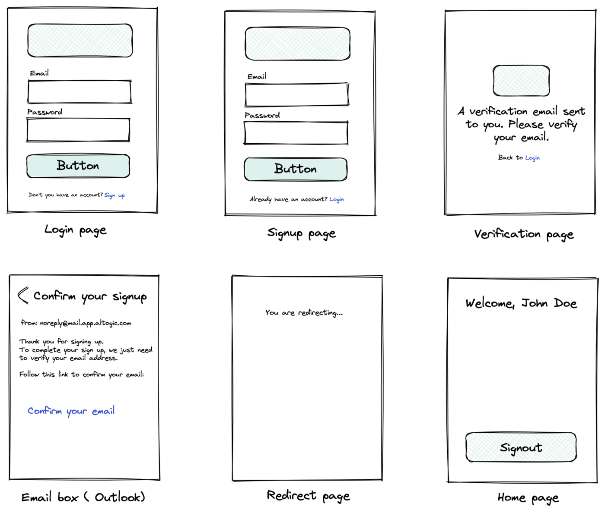
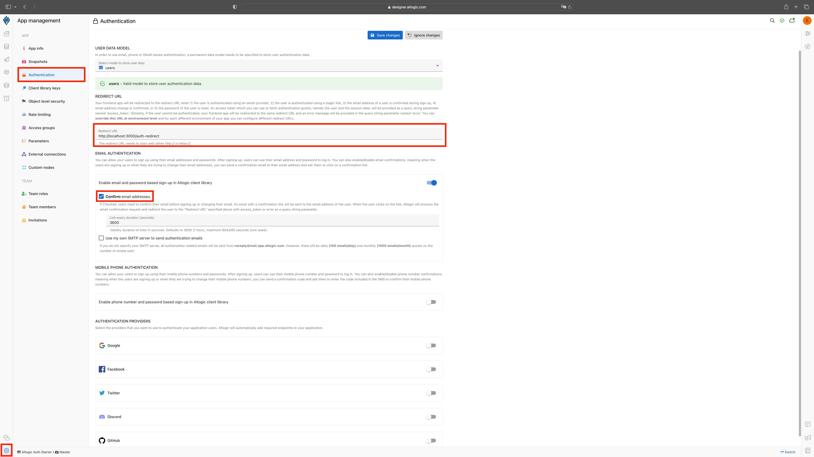
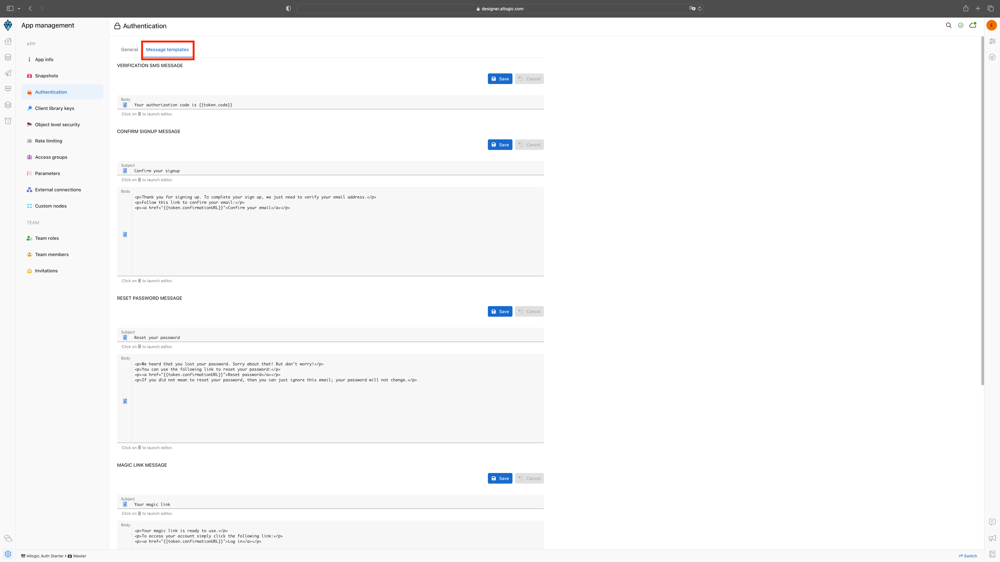
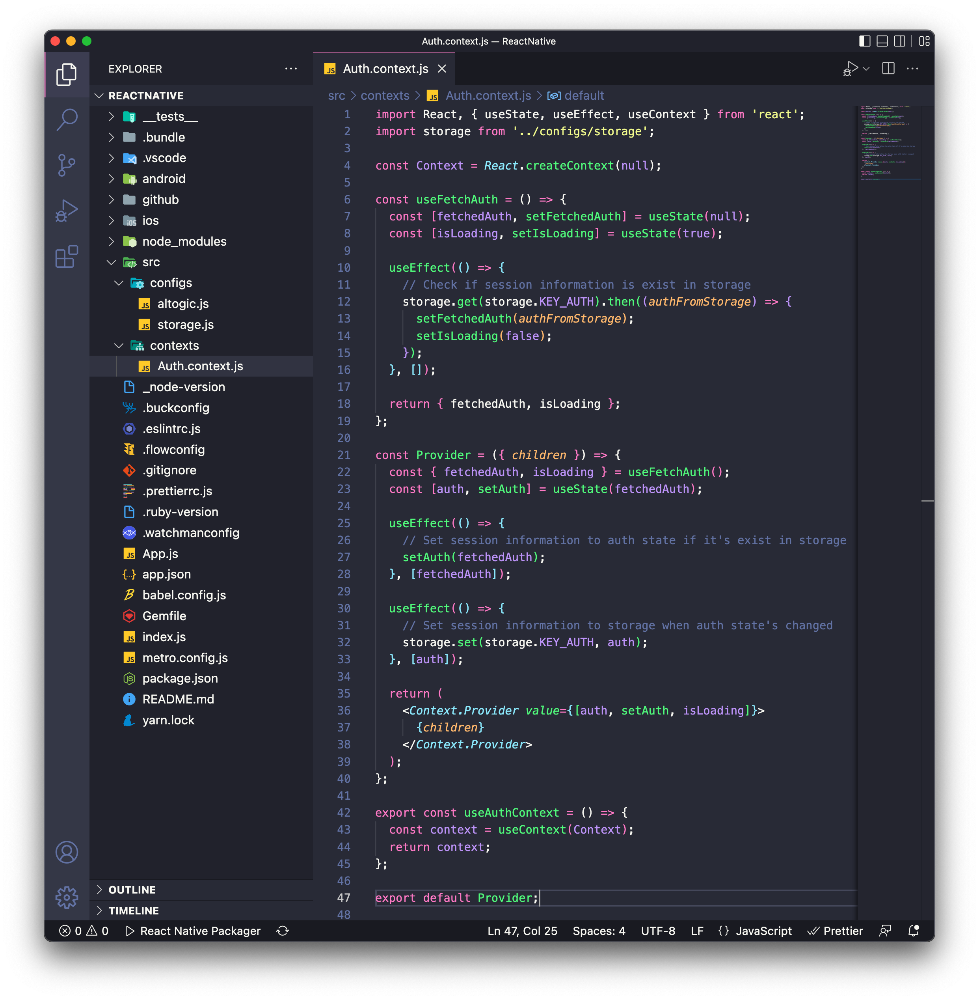
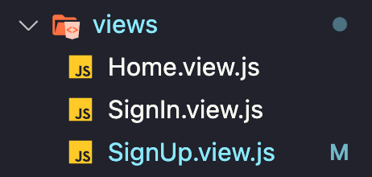
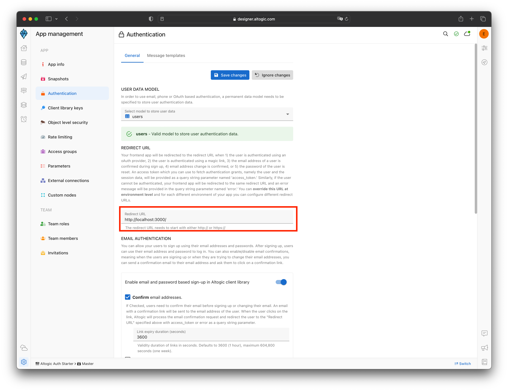

# How to Authenticate Email and Password Using React Native & Altogic


## Introduction
Altogic is a Backend as a Service (BaaS) platform and provides a variety of services in modern web and mobile development. Most of the modern applications using React or other libraries/frameworks require to know the identity of a user. And this necessity allows an app to securely save user data and session in the cloud and provide more personalized functionalities and views to users.

Altogic has an Authentication service that integrates and implements well in JAMstack apps. It has a ready-to-use Javascript client library, and it supports many authentication providers such as email/password, phone number, magic link, and OAuth providers like Google, Facebook, Twitter, Github, etc.,

In this tutorial, we will implement email/password authentication with React Native and take a look how as a React Native developer we build applications and integrate with Altogic Authentication.

After completion of this tutorial, you will learn:

- How to create sample screens to display forms like login and signup.
- How to create a home screen and authorize only logged in users.
- How to create different routes using the react-navigation.
- How to create an authentication flow by conditionally rendering between these pages whether a user is logged-in or not. 
- How to authenticate users using magic link
- How to update user profile info and upload a profile picture
- How to manage active sessions of a user
- And we will integrate Altogic authentication with the email/password method.

If you are new to React Native applications, this tutorial is definitely for you to understand the basics and even advanced concepts.

## Prerequisites
To complete this tutorial, make sure you have installed following tools and utilities on your local development environment.

- [VsCode](https://code.visualstudio.com/download)
- [NodeJS](https://nodejs.org/en/download/)
- [React Native Enviroments](https://reactnative.dev/docs/environment-setup)
- You also need an [Altogic Account](https://designer.altogic.com/). If you have not one yet, you can create an account by signin up to Altogic.

## How email based sign-up works in Altogic
Here are Login and Signup components to collect information from the user.



Once the user created successfully, our react app will route the user to the Verification page, and a verification email will be sent to the user’s email address. When the user clicks the link in the mail, the user will navigate to the redirect page to grant authentication rights. After successfully creating a session on the Redirect page, users will be redirected to the Home page.

## Customize Email Verification
You can disable the email verification,



or you can customize the template.


  
## Creating an Altogic App
We will use Altogic as a backend service platform, so let’s visit [Altogic Designer](https://designer.altogic.com/).

After creating an account, you will see the workspace where you can access your apps.


Click + New app and follow the instructions;

1. In the App name field, enter a name for the app.
2. Enter your subdomain.
3. Choose the deployment location.
4. And select your free execution environment pricing plan.
   


Then click Next and select Basic Authentication template. This template is creates a default user model for your app which is required by [Altogic Client Library](https://github.com/altogic/altogic-js) to store user data and manage authentication.

Then click Next and select Basic Authentication template. This template is based on session authentication and highly recommended to secure your apps.


Then click Next to confirm and create an app.

Awesome! We have created our application; now click/tap on the <strong>newly created app to launch the Designer.</strong>

> This is the only configuration we need to do in Altogic Designer. In order to access the app and use the Altogic client library, we should get envUrl and clientKey of this app.

Click the <strong>Home</strong> icon at the left sidebar to copy the envUrl and clientKey.


## Integrating with Altogic
Our backend is now ready and running on the server. ✨

Now, we can install the Altogic client library to our React app to connect our frontend with the backend.

```sh
# using npm
npm install altogic
# OR is using yarn
yarn add altogic
```

Let’s create a configs/ folder inside of the src/ directory to add altogic.js file.

Open altogic.js and paste below code block to export the altogic client instance.

/src/helpers/altogic.js

```javascript
import { createClient } from 'altogic';

// This `envUrl` and `clientKey` is sample you need to create your own.
let envUrl = 'https://auth.c1-na.altogic.com';
let clientKey = 'e574fee1fb2b443...a8598ca68b7d8';

const altogic = createClient(envUrl, clientKey);

export default { altogic };
```

> Replace envUrl and clientKey which is shown in the <strong>Home</strong> view of [Altogic Designer](https://designer.altogic.com/).

### Storing Session
Now, we can install the [react-native-async-storage](https://react-native-async-storage.github.io/async-storage/docs/install/) library to keep session information in app's storage.

```sh
# using npm
npm install @react-native-async-storage/async-storage
# OR is using yarn
yarn add @react-native-async-storage/async-storage
```

On iOS, use CocoaPods to add the native RNAsyncStorage to your project:

```sh
npx pod-install
```

Let's create a storage.js inside of the configs/ directory.

Open storage.js and paste below code block.
```javascript
import AsyncStorage from '@react-native-async-storage/async-storage';

class Storage {
  constructor() {
    this.KEY_AUTH = '@auth';
  }

  set = async (key, value) => {
    const jsonValue = JSON.stringify(value);
    await AsyncStorage.setItem(key, jsonValue);
  };

  get = async (key) => {
    const jsonValue = await AsyncStorage.getItem(key);
    return jsonValue != null ? JSON.parse(jsonValue) : null;
  };

  remove = async (key) => {
    await AsyncStorage.removeItem(key);
  };
}

export default new Storage();
```
We have created a Storage class that wrapped AsyncStorage to keep the keys together and prevent JSON parse operations every time.

### Create an Authentication Context
We need to share data across our components. We can use this hook throughout our application by creating an authentication context. Passing down the authentication status to each component is redundant. It leads to prop drilling, so using context is a good option. If you are not familiar with Context API in React, check out their docs [here](https://reactjs.org/docs/context.html).

> The React Context API is a state management tool used for sharing data across React components.

Let’s create contexts/ folder inside of the src/ directory to add Auth.context.js file inside it.


Open Auth.context.js and copy following code.

```javascript
import React, { useState, useEffect, useContext } from 'react';
import storage from '../configs/storage';

const Context = React.createContext(null);

const useFetchAuth = () => {
  const [fetchedAuth, setFetchedAuth] = useState(null);
  const [isLoading, setIsLoading] = useState(true);

  useEffect(() => {
    // Check if session information is exist in storage
    storage.get(storage.KEY_AUTH).then((authFromStorage) => {
      setFetchedAuth(authFromStorage);
      setIsLoading(false);
    });
  }, []);

  return { fetchedAuth, isLoading };
};

const Provider = ({ children }) => {
  const { fetchedAuth, isLoading } = useFetchAuth();
  const [auth, setAuth] = useState(fetchedAuth);

  useEffect(() => {
    // Set session information to auth state if it's exist in storage
    setAuth(fetchedAuth);
  }, [fetchedAuth]);

  useEffect(() => {
    // Set session information to storage when auth state's changed
    storage.set(storage.KEY_AUTH, auth);
  }, [auth]);

  return (
    <Context.Provider value={[auth, setAuth, isLoading]}>
      {children}
    </Context.Provider>
  );
};

export const useAuthContext = () => {
  const context = useContext(Context);
  return context;
};

export default Provider;
```

### Private Route Component

To secure the application and authorize users to access specified routes let’s create PrivateRoute.js inside the components directory and paste the code below.

```javascript
import React, { useEffect, useState } from 'react';
import { View, Text } from 'react-native';
import altogic from '../configs/altogic';
import { useAuthContext } from '../contexts/Auth.context';

function PrivateRoute({ children, route, navigation }) {
  const [auth, setAuth, isAuthLoading] = useAuthContext();

  const [isLoading, setLoading] = useState(true);

  const handleToken = async () => {
    setLoading(true);
    const { user } = await altogic.auth.getAuthGrant(
      route.params?.token
    );

    if (user) {
      setAuth(user);
    }
    setLoading(false);
  };

  useEffect(() => {
    if (route.params?.token && !auth) {
      // If the user come from magic link, token's handled
      handleToken();
    } else {
      setLoading(false);
    }
  }, []);

  useEffect(() => {
    if (!route.params?.token && !auth && !isAuthLoading) {
      // Navigate to sign in, if the user has not session or don't come from magic link
      navigation.navigate('SignIn');
    }
  }, [isAuthLoading, auth]);

  return (
    <View>
      {isLoading || isAuthLoading ? (
        <Text>Loading...</Text>
      ) : auth ? (
        children
      ) : (
        <Text>You are redirecting to the login...</Text>
      )}
    </View>
  );
}

export default PrivateRoute;
```

> Previously we have created our authentication context to use user information. And, here, we are controlling session to route users, whether the Login page or the children.

Now we can wrap necessary routes with the PrivateRoute component to specify access in the App.js. Let’s open it and wrap our Home page with the PrivateRoute as the screen below.

Here also you can copy the code;

```javascript
import React from 'react';
import { Text } from 'react-native';
import AuthProvider from './src/contexts/Auth.context';
import { NavigationContainer } from '@react-navigation/native';
import { createNativeStackNavigator } from '@react-navigation/native-stack';
import PrivateRoute from './src/components/PrivateRoute';
import HomeView from './src/views/Home.view';
import SignInView from './src/views/SignIn.view';
import SignUpView from './src/views/SignUp.view';

const Stack = createNativeStackNavigator();

const config = {
  screens: {
    Home: 'home/:token?',
    SignIn: 'sign-in',
    SignUp: 'sign-up'
  }
};

const linking = {
  prefixes: ['myapp://'],
  config
};

function App() {
  return (
    <AuthProvider>
      <NavigationContainer
        linking={linking}
        fallback={<Text>Loading...</Text>}
      >
        <Stack.Navigator>
          <Stack.Screen
            name="Home"
            options={{
              headerLeft: () => null,
              headerBackVisible: false
            }}
          >
            {(props) => (
              <PrivateRoute {...props}>
                <HomeView {...props} />
              </PrivateRoute>
            )}
          </Stack.Screen>
          <Stack.Screen
            name="SignUp"
            component={SignUpView}
            options={{
              headerLeft: () => null,
              headerBackVisible: false
            }}
          />
          <Stack.Screen
            name="SignIn"
            component={SignInView}
            options={{
              headerLeft: () => null,
              headerBackVisible: false
            }}
          />
        </Stack.Navigator>
      </NavigationContainer>
    </AuthProvider>
  );
}

export default App;
```
> Deep linking settings should be set up to handling token. [Deep Link](https://reactnative.dev/docs/linking) 

Let’s continue with the views. Create views/ folder inside of the src/ directory to add Home.view.js, SignIn.view.js and SignUp.view.js files inside it.




### Sign Up

Open SignUp.view.js and paste the below code.

```javascript
import { Link } from '@react-navigation/native';
import React, { useState } from 'react';
import {
  View,
  Button,
  TextInput,
  StyleSheet,
  Text
} from 'react-native';
import altogic from '../configs/altogic';

function SignUpView() {
  const [inpEmail, setInpEmail] = useState('');
  const [inpPassword, setInpPassword] = useState('');

  const [success, setSuccess] = useState('');
  const [error, setError] = useState(null);

  const handleSignUp = async () => {
    try {
      const { errors } = await altogic.auth.signUpWithEmail(
        inpEmail,
        inpPassword
      );

      if (errors) {
        throw errors;
      }

      setSuccess(`We sent a verification link to ${inpEmail}`);
    } catch (err) {
      setError(err);
    }
  };

  return (
    <View style={styles.container}>
      <TextInput
        style={styles.input}
        placeholder="Email"
        autoCapitalize="none"
        placeholderTextColor="white"
        onChangeText={(val) => setInpEmail(val)}
        value={inpEmail}
      />
      <TextInput
        style={styles.input}
        placeholder="Password"
        secureTextEntry={true}
        autoCapitalize="none"
        placeholderTextColor="white"
        onChangeText={(val) => setInpPassword(val)}
        value={inpPassword}
      />
      <Button title="Sign Up" onPress={handleSignUp} />
      <Text style={styles.alreadyLabel}>
        Already have an account?
        <Link style={styles.linkLabel} to="/sign-in">
          Login
        </Link>
      </Text>
      <Text style={styles.successLabel}>{success && success}</Text>
      <Text>{error && JSON.stringify(error, null, 3)}</Text>
    </View>
  );
}

const styles = StyleSheet.create({
  input: {
    width: 350,
    height: 55,
    backgroundColor: '#42A5F5',
    margin: 10,
    padding: 8,
    color: 'white',
    borderRadius: 14,
    fontSize: 18,
    fontWeight: '500'
  },
  container: {
    flex: 1,
    justifyContent: 'center',
    alignItems: 'center'
  },
  successLabel: {
    color: 'green'
  },
  alreadyLabel: {
    marginTop: 20
  },
  linkLabel: {
    color: 'blue'
  }
});

export default SignUpView;
```

### Sign In

Open SignIn.view.js and paste the below code.

```javascript
import { Link } from '@react-navigation/native';
import React, { useState } from 'react';
import {
  View,
  Button,
  TextInput,
  StyleSheet,
  Text
} from 'react-native';
import altogic from '../configs/altogic';
import { useAuthContext } from '../contexts/Auth.context';

function SignInView({ navigation }) {
  const [auth, setAuth] = useAuthContext();

  const [inpEmail, setInpEmail] = useState('');
  const [inpPassword, setInpPassword] = useState('');

  const [error, setError] = useState(null);

  const handleSignIn = async () => {
    try {
      const { user, errors } = await altogic.auth.signInWithEmail(
        inpEmail,
        inpPassword
      );

      if (errors) {
        throw errors;
      }

      setAuth(user);
      navigation.navigate('Home');
    } catch (err) {
      setError(err);
    }
  };

  return (
    <View style={styles.container}>
      <TextInput
        style={styles.input}
        placeholder="Email"
        autoCapitalize="none"
        placeholderTextColor="white"
        onChangeText={(val) => setInpEmail(val)}
        value={inpEmail}
      />
      <TextInput
        style={styles.input}
        placeholder="Password"
        secureTextEntry={true}
        autoCapitalize="none"
        placeholderTextColor="white"
        onChangeText={(val) => setInpPassword(val)}
        value={inpPassword}
      />
      <Button title="Login" onPress={handleSignIn} />
      <Text style={styles.alreadyLabel}>
        Don't have an account yet?
      </Text>
      <Link style={styles.linkLabel} to="/sign-up">
        Create an account
      </Link>
      <Text>{error && JSON.stringify(error, null, 3)}</Text>
    </View>
  );
}

const styles = StyleSheet.create({
  input: {
    width: 350,
    height: 55,
    backgroundColor: '#42A5F5',
    margin: 10,
    padding: 8,
    color: 'white',
    borderRadius: 14,
    fontSize: 18,
    fontWeight: '500'
  },
  container: {
    flex: 1,
    justifyContent: 'center',
    alignItems: 'center'
  },
  successLabel: {
    color: 'green'
  },
  alreadyLabel: {
    marginTop: 20
  },
  linkLabel: {
    color: 'blue'
  }
});

export default SignInView;
```

### Home

Open Home.view.js and paste the below code.

```javascript
import React from 'react';
import { Text, View, Button } from 'react-native';
import altogic from '../configs/altogic';
import { useAuthContext } from '../contexts/Auth.context';

function HomeView({ navigation }) {
  const [auth, setAuth] = useAuthContext();

  const handleSignOut = async () => {
    await altogic.auth.signOut();
    setAuth(null);
    navigation.navigate('SignIn');
  };

  return (
    <View>
      <Text>{auth && JSON.stringify(auth, null, 3)}</Text>
      <Button title="Sign Out" onPress={handleSignOut} />
    </View>
  );
}

export default HomeView;
```
## Magic Link Authentication
Firstly, We will create a react web project in local to the redirected url. This url takes access_token, status and action as parameters. We will handle it in this project.

```cli
npx create-react-app my-app
```

Open App.js and paste the below code.
```javascript
import './App.css';
import { useSearchParams, useNavigate } from "react-router-dom";

function App({props}) {
  const [params] = useSearchParams();
  const token = params.get("access_token")

  return (
    <div className="App">
      <header className="App-header">
        <h1>Email is confirmed.</h1>
        <a href={`myapp://home?token=${token}`} _blank>
          Back to app
        </a>
      </header>
    </div>
  );
}

export default App;
```

We have given the deep link with token. Let's change the redirect url in altogic.



We made it.✨


## Bonus
### Uplodading changing and removing profile picture

> You will need a file picker that works on the environment you will build the project for, we will use [react-native-image-picker]('https://github.com/react-native-image-picker/react-native-image-picker') in this example.

Open Home.view.js again and paste the below code to create or remove an avatar for the user.

```javascript
import React, { useState } from 'react';
import {
  Text,
  View,
  Button,
  StyleSheet,
  TouchableOpacity,
  Image,
  ActivityIndicator
} from 'react-native';
import { launchImageLibrary } from 'react-native-image-picker';
import altogic from '../configs/altogic';
import { useAuthContext } from '../contexts/Auth.context';

function HomeView({ navigation }) {
  const [auth, setAuth] = useAuthContext();

  const [loading, setLoading] = useState(false);

  const handleSignOut = async () => {
    await altogic.auth.signOut();
    setAuth(null);
    navigation.navigate('SignIn');
  };

  // Bonus
  const handleUploadPhoto = async () => {
    try {
      let asset = null;
      const res = await launchImageLibrary({
        mediaType: 'photo',
        quality: 1,
        includeBase64: true
      });
      if (!res.didCancel && res.errorCode !== 'permission') {
        asset = res.assets[0];
      }
      if (!asset) {
        throw new Error('No valid file');
      }

      const formData = new FormData();
      formData.append('file', {
        uri: asset.uri,
        type: asset.type,
        name: asset.fileName
      });

      setLoading(true);

      const { publicPath } = await uploadPhoto(formData, auth.email);
      await updateUserInfo({ profilePicture: publicPath });
      setLoading(false);
    } catch (error) {
      console.log(error);
    }
  };

  const uploadPhoto = async (file, filename) => {
    const { data, errors } = await altogic.storage
      .bucket('root')
      .upload(filename, file);

    if (errors) {
      throw errors;
    }
    return data;
  };

  const handleRemovePhoto = async () => {
    setLoading(true);
    await altogic.storage.bucket('root').deleteFiles([auth.email]);
    await updateUserInfo({ profilePicture: null });
    setLoading(false);
  };

  const updateUserInfo = async (data) => {
    const { data: userFromDB, errors } = await altogic.db
      .model('users')
      .object(auth._id)
      .update(data);

    if (errors) {
      throw errors;
    }
    setAuth(userFromDB);
  };

  return (
    <View>
      <Text>{auth && JSON.stringify(auth, null, 3)}</Text>
      <Button title="Sign Out" onPress={handleSignOut} />
      <View style={styles.container}>
        {loading ? (
          <ActivityIndicator />
        ) : (
          <Image
            style={styles.tinyLogo}
            source={{
              uri:
                auth.profilePicture ||
                `https://ui-avatars.com/api/?name=${auth.email}&background=0D8ABC&color=fff`
            }}
          />
        )}
      </View>
      <TouchableOpacity
        style={styles.buttonStyle}
        activeOpacity={0.5}
        onPress={handleUploadPhoto}
      >
        <Text style={styles.buttonTextStyle}>Upload Photo</Text>
      </TouchableOpacity>
      <TouchableOpacity
        style={styles.buttonStyle}
        activeOpacity={0.5}
        onPress={handleRemovePhoto}
      >
        <Text style={styles.buttonTextStyle}>Remove Photo</Text>
      </TouchableOpacity>
    </View>
  );
}

const styles = StyleSheet.create({
  container: {
    flex: 1,
    justifyContent: 'center',
    alignItems: 'center',
    marginTop: 100,
    marginBottom: 100
  },
  buttonStyle: {
    backgroundColor: '#307ecc',
    borderWidth: 0,
    color: '#FFFFFF',
    borderColor: '#307ecc',
    height: 40,
    alignItems: 'center',
    borderRadius: 30,
    marginLeft: 35,
    marginRight: 35,
    marginTop: 15
  },
  buttonTextStyle: {
    color: '#FFFFFF',
    paddingVertical: 10,
    fontSize: 16
  },
  tinyLogo: {
    width: 150,
    height: 150
  }
});

export default HomeView;
```

## Conclusion
Congratulations!✨

You had completed the most critical part of the Authentication flow, which includes private routes, sign-up, sign-in, and sign-out operations.

> If you have any questions about Altogic or want to share what you have built, please post a message in our [Community Forum](https://community.altogic.com/) or [Discord Channel](https://discord.gg/ERK2ssumh8).


